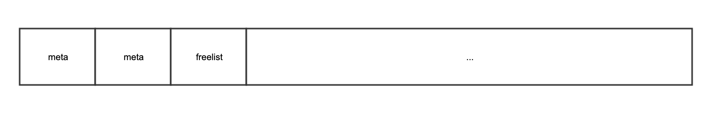
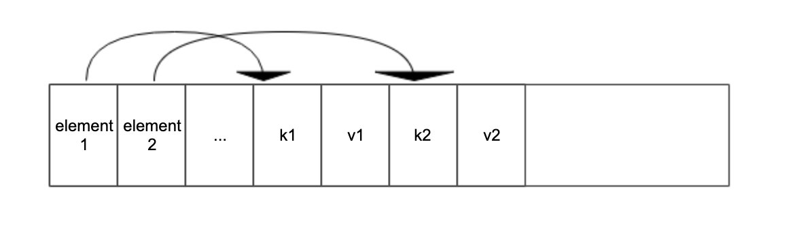
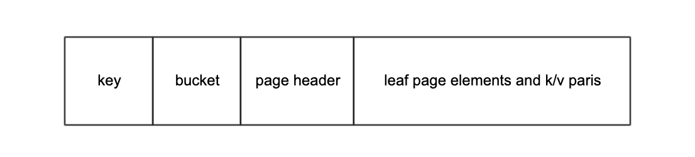
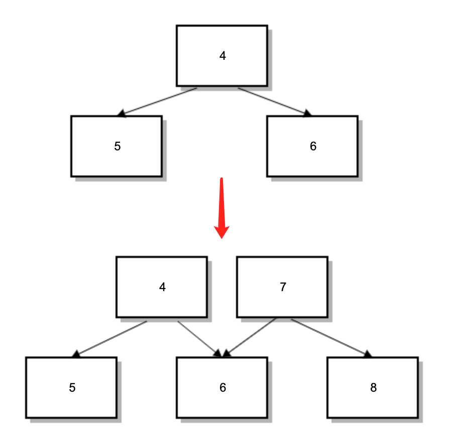

## boltdb 原理探究


###  简介

boltdb是golang实现的kv数据库，支持事务，内部存储基于b+树数据结构，因为boltdb是以golang库的形式使用，加上它本身比较简单可靠，所以在golang社区中比较受欢迎，

我所知道的一些著名项目都有使用boltdb作为底层数据存储：bleve、consul、etcd。

为了篇幅，本文不对b+树做介绍，同时因为这篇文章是介绍原理和思路，我会提出我最初产生的很多疑问，读者可以根据兴趣去寻找答案，

带着问题去读源码效率会高很多。


### 数据是如何在内存和磁盘之间序列化和反序列化的？

boltdb使用b+树来存储数据，序列化后的数据是存储在磁盘中，我们可以当作一个大的二进制数组，

boltdb在内存中用data `data     *[maxMapSize]byte`， 来表示这个二进制数组。

后续将介绍b+树是如何存储在这个二进制数组中的。

这个大的二进制数组boltdb用页为单位来进行管理，

boltdb的页和操作系统的页类似，大小一般为4k。

boltdb使用mmap将磁盘文件映射到内存中，这里我简单介绍下mmap：

```text
    mmap将磁盘上文件的一个连续区域映射到内存中一段连续的空间地址，因为程序进程中使用的虚拟空间地址是连续的，由操作系统和底层硬件mmu配合来翻译到物理地址，

    所以我们在程序中就可以假装访问一段连续的内存一样访问文件内容了，当访问的内存页不存在时会触发缺页异常，内核会尝试将文件对应的内容加载到内存页中，

    然后cpu继续执行上次导致缺页异常的指令，这条指令就像上次一样访问内存，因为刚刚已经加载到内存中了，所以这次就获取到了。
    
    当对mmap的内存区域更改时，这些更改也会作用于映射的文件部分。

    mmap是是以页来进行映射的，如果文件大小不是整数倍页大小，映射的最后一页中超出文件大小部分全部初始化为0了，但是如果访问超过最后一页，

    那还是会抛出缺页异常。感兴趣的可以思考下：
    1， 既然mmap映射的范围可以超出文件范围，那岂不是可能访问超出文件范围内容？
    2， db.data是个256TB大小的数组，这么大的数组不会撑爆内存吗？
```

boltdb使用mmap来达到访问数据库文件和缓存数据的目的，由于内存有限，数据库文件可能会很大，这种情况下只能部分数据会被缓存，boltdb将缓存策略也交由操作系统控制。

一个页被分为两部分：页头和页体，页头存储了当前页的一些元数据，结构为：

```go
type page struct {
	id       pgid
	flags    uint16
	count    uint16
	overflow uint32
	ptr      uintptr
}
```


id 记录了页的id，在boltdb中，对page的引用都是通过id来引用的，通过id就能计算出page的位置。

我们知道了id和pagesize，通过 id * pagesize，就计算出了当前page在db.data中的位置。

overflow记录了当前page除了自身还占用几个连续的页。

flags标识当前的page类型，boltdb中一共有四个类型page：



- 前两个是固定的，meta page，用来管理boltdb元数据
- freelist page，用来管理空闲page
- branch page，用来存储b+树branch节点
- leaf page，用来存储b+树leaf节点

count表示当前页有多少个节点。
ptr这里不表示实际数据，只是用来获取页头的结尾，也就是数据的开始。


#### 反序列化


```go
func (db *DB) page(id pgid) *page {
	pos := id * pgid(db.pageSize)
	return (*page)(unsafe.Pointer(&db.data[pos]))
}
```
通过pageid找到了在db.data中的位置，使用unsafe包来将二进制数据转换成page指针，boltdb都是使用这个方法来反序列化二进制数据，

注意这里没有涉及大小端的指定，不过因为boltdb定位是嵌入式数据库，不需要在各个系统中传输数据，读取都使用的同一种字节序，而且现在大多数cpu都是小端，

所以boltdb没有指定。

#### 序列化

boltdb读取使用的内存映射，但是写入使用的write系统调用，写入时，同样会通过 id * pagesize计算出当前page在db.data中的位置，也就是在磁盘文件中的位置，
然后将页写入文件对应的区域。

db.data只是用来读取用的，当事务更改数据时，boltdb采用cow（copy on write）思路，分配新的page，将原始page数据拷贝到新的page（dirty page），最后事务提交时将dirty page，直接写入文件对应区域。

这里为什么不用mmap来实现自动写，而是要用write系统调用呢？感兴趣的可以思考下。


### B+树如何存储在磁盘上的？


```go


type node struct {
	bucket     *Bucket
	isLeaf     bool
	unbalanced bool
	spilled    bool
	key        []byte
	pgid       pgid
	parent     *node
	children   nodes
	inodes     inodes
}


type inode struct {
	flags uint32 // isLeaf or isBranch
	pgid  pgid // branch节点用来指向子节点page
	key   []byte
	value []byte
}

type inodes []inode

type nodes []*node

```

前面我们知道，boltdb使用内存映射来将文件映射到内存里，所以这个问题我们也可以看作如何将b+树存储在一个大的二进制数组中。

node是page在内存中被反序列化的数据结构，相反，page时node在磁盘中序列化后的数据结构。

不过boltdb只有在要更新page时才会将page反序列化成node，否则还是直接从page去读取数据。

node也是b+树的一个节点，一个b+树内部又有多个inode，对于branch节点，inode的pgid指向了子节点的page id，对于leaf节点，k/v就是最终数据的k/v对。

leaf节点内的inode对应磁盘中的数据结构为：

```go
type leafPageElement struct {
	flags uint32
	pos   uint32 // leaf k/v对的位置
	ksize uint32 // key字节长度
	vsize uint32 // value长度
}
```

branch节点内的inode对应磁盘中的数据结构为：

```go
type branchPageElement struct {
	pos   uint32 // branch 
	ksize uint32    
	pgid  pgid
}
```

branchPageElement和leafPageElement，只是标明了k/v对的位置，并没有存储k/v对的数据，那k/v对存储到哪了呢？

我们以leafPageElement为例，他们是按照下图来排布的：



pos怎么算出来的呢，很简单，就是以leafPageElement或者branchPageElement的指针地址为起始地址，距离真正的k/v对的地址距离，这样获取k/v时，就能很容易

找到k/v对的地址，对应代码：

```go
// key returns a byte slice of the node key.
func (n *branchPageElement) key() []byte {
	buf := (*[maxAllocSize]byte)(unsafe.Pointer(n))
	return (*[maxAllocSize]byte)(unsafe.Pointer(&buf[n.pos]))[:n.ksize]
}
```

### bucket是什么？

bucket为boltdb提供了namespace功能，类似于关系数据库中的表，boltdb支持在bucket中创建bucket，bucket在磁盘中的数据结构为：

```go
// bucket represents the on-file representation of a bucket.
// This is stored as the "value" of a bucket key. If the bucket is small enough,
// then its root page can be stored inline in the "value", after the bucket
// header. In the case of inline buckets, the "root" will be 0.
type bucket struct {
	root     pgid   // page id of the bucket's root-level page
	sequence uint64 // monotonically incrementing, used by NextSequence()
}
```

bucket就根普通k/v对一样存储在b+树节点中，只不过value是bucket。

root指向了当前bucket的b+树根节点，当bucket中数据比较少时，bucket变为inline bucket，root == 0，这时，root的page就挨着bucket，如下图：




bucket在内存中的数据结构：

```go
// Bucket represents a collection of key/value pairs inside the database.
type Bucket struct {
	*bucket
	tx       *Tx                // the associated transaction
	buckets  map[string]*Bucket // subbucket cache
	page     *page              // inline page reference
	rootNode *node              // materialized node for the root page.
	nodes    map[pgid]*node     // node cache

	// Sets the threshold for filling nodes when they split. By default,
	// the bucket will fill to 50% but it can be useful to increase this
	// amount if you know that your write workloads are mostly append-only.
	//
	// This is non-persisted across transactions so it must be set in every Tx.
	FillPercent float64
}
```

Bucket是在事务中被反序列化出来的，所以一个Bucket对应一个事务。


### 事务是怎么实现的？

boltdb支持读事务和读写事务，读事务和读写事务可以并发执行，但是写事务之间是互斥的。boltdb的事务支持mvcc，所以boltdb的事务隔离界别是串行，不会出现脏读与幻读，并且是可重复读的，

当然代价就是写入的速度相对比较慢了。

那boltdb的事务是怎么实现的呢？

事务的数据结构：

```go
// Tx represents a read-only or read/write transaction on the database.
// Read-only transactions can be used for retrieving values for keys and creating cursors.
// Read/write transactions can create and remove buckets and create and remove keys.
//
// IMPORTANT: You must commit or rollback transactions when you are done with
// them. Pages can not be reclaimed by the writer until no more transactions
// are using them. A long running read transaction can cause the database to
// quickly grow.
type Tx struct {
        other fields ***
	writable       bool
	db             *DB
	meta           *meta
	root           Bucket
	pages          map[pgid]*page
	commitHandlers []func()

	// WriteFlag specifies the flag for write-related methods like WriteTo().
	// Tx opens the database file with the specified flag to copy the data.
	//
	// By default, the flag is unset, which works well for mostly in-memory
	// workloads. For databases that are much larger than available RAM,
	// set the flag to syscall.O_DIRECT to avoid trashing the page cache.
	WriteFlag int
}
```

writable 表示当前事务是否时只读

这里引入另两个数据结构：

```go
type meta struct {
	magic    uint32
	version  uint32
	pageSize uint32
	flags    uint32
	root     bucket
	freelist pgid
	pgid     pgid
	txid     txid
	checksum uint64
}

```

magic, version, checksum用来校验数据库文件合法性和版本的。

freelist指向freelist所在page，pgid指向最后一个page，访问page时不会超过这个值，写入时如果发现超过该值，表示文件大小不够用了，会扩大文件大小。

txid是最后一个成功提交的事务的id，root就指向了该事务的root bucket。

当一个事务成功更改meta后，就标志着tx提交成功了。

boltdb有两个meta，取meta的时候，会先从txid大的meta开始读取，再检查meta数据完整性，如果两个meta都有问题，则表明数据库文件已经损毁了。

写meta的时候，会根据txid决定写入哪个meta `pageid = m.txid % 2`。

因为两个meta的事务id不一样，所以指向的bucket和freelist也不一样，他们代表了最后两个事务的数据版本和free pages列表。


```go
// freelist represents a list of all pages that are available for allocation.
// It also tracks pages that have been freed but are still in use by open transactions.
type freelist struct {
	ids     []pgid          // all free and available free page ids.
	pending map[txid][]pgid // mapping of soon-to-be free page ids by tx.
	cache   map[pgid]bool   // fast lookup of all free and pending page ids.
}
```

ids维护了所有可用的page，cache只在内存中存在，不会存到磁盘中，cache是pending和ids的合集，主要用来快速查找。

pending和ids序列化到page中时，会放在一起，在一个pgid数组里。

当需要分配连续N个page大小的page时，boltdb会先尝试在freelist中查找满足要求的page，时间复杂度是O(N),当数据库文件比较大时，可能会引起性能问题.

现由社区维护的 [bbolt](https://github.com/etcd-io/bbolt)，实现了一种 [O(1)复杂度的分配算法](https://medium.com/@Alibaba_Cloud/performance-optimization-of-etcd-in-web-scale-data-scenario-b2eccae5d636)，感兴趣的可以去看下

如果freelist中没查找到，则会使用mmap将映射的范围扩大，大小在1GB以前，会翻倍，达到1GB则增加1GB，这时分配的pageid比meta的pgid大，表明当前已经超过数据库文件大小了，

在序列化这些page前，会先扩大数据库文件。

### 事务的mvcc是如何实现的呢？

当事务需要更改数据时，会先将对应的page反序列化成node，再重新分配一个新的page，而不是更新原来的page，更改了数据的node被序列化到这个新的page，老的page交由freelist来记录，

记录在pending里面，key是当前事务id，value是当前事务重新分配了的新page列表对应的老page列表，

pending里面的page不会里面被视为可用的free pages，只有当对应的事务提交或者回滚时，才会被回收为free page。

更新了node，也就是b+树节点，还会更新所有的祖先节点，然后将最终的根节点设为当前bucket的rootNode，这样老事务和新事务的b+树根节点不一样，读到的数据也都是各自版本的数据了，

这样就达到了事务隔离的效果了。


如下图：



最初事务11看到的b+树的根节点page是4，当事务12更改了page5的数据时，它不会直接更改page5，会将page4、5序列化成node4、5，，然后更改node的数据，

node4是node5的父节点，因为node5最终要序列化到page8，所以node4也会更改，将对应的key指向的pageid变更为8。

事务提交时，boltdb分配了7、8，分别将node4、node5序列化到page7、page8。

然后将7、8写入
磁盘，这样，事务11和事务12看到的数据都是各自版本的数据了。

刚刚我们看到事务12，因为需要更改page4、5，所以新分配了page7、8，当事务提交成功后，会更新meta的root和txid，当更新meta成功后，就标志这事务成功提交了。

下次新事务从meta里找bucket的rootNode时，拿到的就是上次成功提交的了。

page4、5怎么处理呢？

会放到freelist的pending里，key是12（事务12的txid），value是`[]pgid{4,5}`,当下一次事务13开始的时候，会从db维护的

tx列表里面找到当前正在执行的最老的事务id（id最小），然后发现pending的key里如果有比刚刚找到的最小事务id还小的id，则表示这些pending

的页已经不会有老的事务会读取了，当下次分配空闲page时可以拿来用了。

每次事务有更新数据后，freelist也会更新，所以在每次事务提交时，同时也会为freelist分配page，然后写入freelist。


