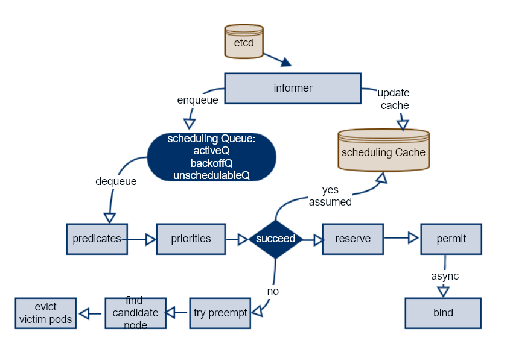
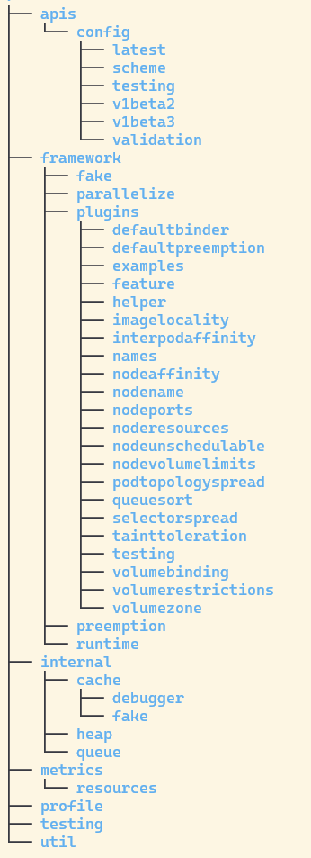
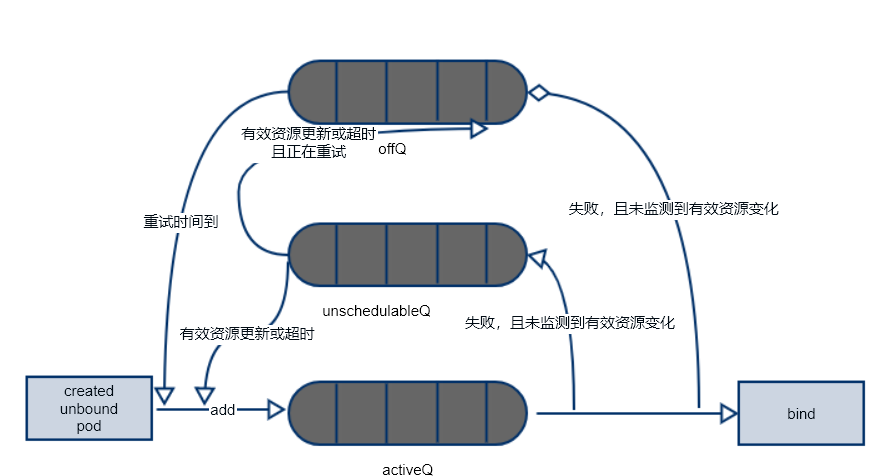

# k8s scheduler源码初探

## 概览

scheduler是k8s一个核心的组件，它监测集群中创建的但是还没有被调度到node的pod，并将它调度到一个合适的node上。

## 需求和设计

什么是合适的node呢？

实际情况需要考虑的情况特别多，这里举例一些常见的情况：
- nodeSelector

        一个pod可能会筛选满足条件的node，通过label实现，灵活实现各种筛选条件。
- nodeAffinity

        节点亲和性，相比nodeSelector来说可以实现软需求/偏好。
        亲和性也分软亲和/硬亲和，硬亲和和nodeSelector类似，但是提供了比nodeSelector更强大的筛选语法。

- podAffinity/podAntiAffinity

        pod之间亲和性和反亲和性，亲和性一个示例：“将服务 A 和服务 B 的 Pod 放置在同一区域，因为它们之间进行大量交流”，
		反亲和性一个示例：“将此服务的 pod 跨区域分布”。
- taints/toleration

        taints（污点）是应用于node，toleration（容忍度）应用于pod，调度器会避免将不能容忍污点的pod调度给污点对应的node。

- pod优先级和抢占

        当资源不足等情况时，一个高优先级pod可能会抢占低优先级的pod，具体抢占哪个node上的哪些pod，又需要综合考虑很多因素。

- node各种资源是否满足pod需求

        例如cpu，内存，磁盘，网络，端口等等。

- 优先调度到资源最充足的节点
- 资源平衡

        如果cpu被大量分配，但是memory分配很少，就属于资源不平衡，这样memory就被浪费了，这种情况应该尽量避免。

- 高可用

        例如同一个deployment的不同pod应该分配到不同的node上，尽量实现高可用。

- 等等其他因素

从上述列表可以看到，scheduler在调度的时候需要综合考虑一系列因素，然后找出最合适的node。


笔者认为，一个好的调度器它有以下优点：
- 资源高效利用
- 快速响应调度请求
- 灵活扩展，轻松实现自定义调度需求
- 良好的架构设计，降低维护和扩展的难度

接下来让我们来看看k8s是怎么实现scheduler的吧。

## 实现


### 整体架构

#### 流程图


#### 概念解释

- informer

        利用etcd的Watch&List机制，在本地维护了自己所关心对象的缓存，同时能监测获取到这些关心对象的变化，并更新本地缓存，减轻api server压力。
- schedulerQueue

        activeQ： 一个堆数据结构构成的队列，即将被调度的pod就放在这个队列里，每次获取的pod都是优先级最高的一个。

        unschedulableQ：一个map数据结构构成的队列，一般情况下，当pod调度失败了，就放入这个队列。

        podBackoffQ：一个堆数据结构构成的队列，这里面的pod会按照指数退避策略重试。

- scheduleCache

        调度相关的cache，里面存储了跟调度相关的各种数据，很多是聚合产生的数据，这样不用每次再去查询、聚合，能大幅提升性能。

- framework

        framework是针对调度器设计的一种插件机制，上文提到的各种需求都是通过各种插件来实现的，
		这样能让调度器代码保持足够简单，还能保证扩展性，当需要更改一些策略时，更改相应的插件代码就行了，其他代码都不用动。
        流程图中倒数第二行都属于framework部分。

- predicates
        通过各种插件来过滤掉不满足条件的node。

- priorities
        通过各种插件将满足过滤条件的nodes打分，得到分数最高的。

- reserve
        为pod申明的一些资源预留，防止绑定的时候资源被其他pod占用导致绑定失败，因为绑定是异步的。

- permit
        通过插件来决定是否permit，可能允许，拒绝或者等待。

- bind
        通过调用apiserver接口将node和pod绑定，对应node上的kubelet会监听这个事件，来启动pod。
- preempt

        当调度失败时，scheduler会尝试寻找一个合适的node，并且抢占上面优先级较低的pods。


#### 流程简述：
- 当scheduler接收到自己关心的事件时，比如一个还未被调度的pod被创建了，就将这个pod放入调度队列中。

        还会监听各种跟调度相关的事件，比如某些资源变化，调度器认为这些资源变化了可能会让某些pod从不可调度状态变为可调度状态，会重新尝试调度。
- 启用一个协程不断从activeQ里面去pod，为这个pod做调度处理
- 使用framework的各种插件来筛选掉不合适的，将剩下的nodes进入下一阶段。
- 调度器同样使用插件来给各个nodes打分，然后选出最优的node。

- 当调度失败后，则执行抢占操作，调度器尝试找到合适的node，并将这些node上一些优先级较低等pods驱逐，然后再下一轮调取周期就很可能能够成功被调度了，如果抢占失败，这个pod会被放入调度队列等待再次被调度。
- 如果调度成功，调度器通过插件为pod预留一些pod申明的资源，以防异步绑定pod到node的时候资源已经被占用。
- 资源预留成功后，经过permit插件处理，处理结果可能是允许/拒绝或等待。
- 接下来调度器就开始下一个调度周期了，因为绑定是一个比较耗时的操作，所以将绑定异步处理，能够加快调度速度，

## 调度框架

介绍完大概的调度流程后，我们再来介绍下framework，我们知道大部分调度策略都是通过插件实现的，这样当我们需要更改或者定制我们自己的策略时，整个调度流程都是不用改的，扩展性得以体现。

这里我借用下官方文档的调度框架：


框架设计了很多扩展点，会在不同阶段执行：

- sort
        pod排序逻辑，默认按照优先级、时间排序
- preFilter
        主要为过滤准备必要数据
- filter
        过滤nodes，剩下的nodes作为调度候选
- postFilter
        当调度失败时执行，主要用来抢占

- preScore
        为评分阶段准备好数据
- score
        将候选节点进行打分，每个配置的插件都参与打分，最后根据插件权重计算最终分数

- normalizeScore
        不同插件计算的最大分数可能不一样，无形中引入了权重，要将其标准化。

- reserve
        为pod在节点上预留资源

- permit

        一个调度周期最后执行的插件扩展点。


## 源码

啰嗦了一大堆，接下来让我们看下k8s是如何实现调度的吧。

### 代码目录结构

调度器代码入口在 `cmd/kube-scheduler`目录下,通过函数调用路径
`main` -> `runCommand` -> `Run` -> `sched.Run`来完成调度器的启动,cli, 参数校验，配置初始化等都在这里面实现的。


上面是cmd入口代码，而调度器主体代码在`pkg/scheduler`下面，执行下`tree -Ld 3`，看下代码目录结构：



`apis/config`是目录相关的代码

`framework`从名字就能看出来是干嘛的了，可以看到里面有很多插件，有过滤和打分的，有的插件可能会有多个扩展点，比如nodeAffinity既有过滤又有打分扩展点。我们可以挑两个来说明它们的作用：

`selectorsSpread`：通过它可以将同一个deploy/rc的多个pods尽量分布在不同节点上，以实现高可用。

`imagelocality`:它可以帮助调度器决策时，考虑将pod调度到已经有镜像的节点上。

`internal`: `queue`, `heap`, `cache`这几个重要的数据结构都存放在这。

`profile`: 不同的framework注册的地方，调度的时候可以指定不同的framework，默认只有一个。

### scheduler默认插件配置
scheduler默认会开启以下插件,你可以配置不同的插件和他们的权重，来实现您想要的效果：

```golang

// getDefaultPlugins returns the default set of plugins.
func getDefaultPlugins() *v1beta3.Plugins {
	plugins := &v1beta3.Plugins{
		MultiPoint: v1beta3.PluginSet{
			Enabled: []v1beta3.Plugin{
				{Name: names.PrioritySort},//用来排序队列中的pod
				{Name: names.NodeUnschedulable},// 用来过滤pod无法调度的node
				{Name: names.NodeName},// pod可能指定了node名字
				{Name: names.TaintToleration, Weight: pointer.Int32(3)},// taint/toleration过滤和打分
				{Name: names.NodeAffinity, Weight: pointer.Int32(2)},
				{Name: names.NodePorts},// 过滤pod申明的端口被占用的node
				{Name: names.NodeResourcesFit, Weight: pointer.Int32(1)},// 根据资源情况过滤和打分
				{Name: names.VolumeRestrictions},
				{Name: names.EBSLimits},
				{Name: names.GCEPDLimits},
				{Name: names.NodeVolumeLimits},
				{Name: names.AzureDiskLimits},
				{Name: names.VolumeBinding},
				{Name: names.VolumeZone},
				{Name: names.PodTopologySpread, Weight: pointer.Int32(2)},//尽量将相同deploy/rc下的pods分布在不同的拓扑区域下 
				{Name: names.InterPodAffinity, Weight: pointer.Int32(2)}, // pod间的亲和性
				{Name: names.DefaultPreemption}, // 默认抢占逻辑
				{Name: names.NodeResourcesBalancedAllocation, Weight: pointer.Int32(1)}, // 资源平衡
				{Name: names.ImageLocality, Weight: pointer.Int32(1)},
				{Name: names.DefaultBinder}, // 默认bind实现
			},
		},
	}
    ...

	return plugins
}
```

### scheduler结构体
上面说到cmd的入口最终调用到主体代码中的函数是`sched.Run`，它的逻辑很简单：调用schedulingQueue.Run(),并循环调用sched.ScheduleOne()，开始循环调度。


```golang

// Scheduler watches for new unscheduled pods. It attempts to find
// nodes that they fit on and writes bindings back to the api server.
type Scheduler struct {
	// It is expected that changes made via SchedulerCache will be observed
	// by NodeLister and Algorithm.
	SchedulerCache internalcache.Cache
    // 调度逻辑
	Algorithm ScheduleAlgorithm
    // 第三方调度策略扩展，通过http api调用
	Extenders []framework.Extender


    // 取activeQ队首的pod，当没有pod可取的时候，会阻塞。
	NextPod func() *framework.QueuedPodInfo

	// 当调度失败的时候会由这个函数处理错误，它会在没有调度成功和抢占成功时，将pod重新放置到backOffQ或者unschedulableQ里面
	Error func(*framework.QueuedPodInfo, error)

	// Close this to shut down the scheduler.
	StopEverything <-chan struct{}

	// SchedulingQueue holds pods to be scheduled
	SchedulingQueue internalqueue.SchedulingQueue

	// Profiles are the scheduling profiles.
	Profiles profile.Map
    // client-go客户端，用来和api server通信
	client clientset.Interface
}

// Run begins watching and scheduling. It starts scheduling and blocked until the context is done.
func (sched *Scheduler) Run(ctx context.Context) {
	sched.SchedulingQueue.Run()
    // 不断循环调用sched.scheduleOne
	wait.UntilWithContext(ctx, sched.scheduleOne, 0)
	sched.SchedulingQueue.Close()
}


```

### schedule Queue

`scheduler.Run`首先调用的queue.Run函数，我们就先来看看它到底在做什么？

```golang

// PriorityQueue implements a scheduling queue.
// The head of PriorityQueue is the highest priority pending pod. This structure
// has three sub queues. One sub-queue holds pods that are being considered for
// scheduling. This is called activeQ and is a Heap. Another queue holds
// pods that are already tried and are determined to be unschedulable. The latter
// is called unschedulableQ. The third queue holds pods that are moved from
// unschedulable queues and will be moved to active queue when backoff are completed.
type PriorityQueue struct {
	// PodNominator abstracts the operations to maintain nominated Pods.
	framework.PodNominator
    ...

	// pod initial backoff duration.
	podInitialBackoffDuration time.Duration
	// pod maximum backoff duration.
	podMaxBackoffDuration time.Duration

    ...

	// activeQ is heap structure that scheduler actively looks at to find pods to
	// schedule. Head of heap is the highest priority pod.
	activeQ *heap.Heap
	// podBackoffQ is a heap ordered by backoff expiry. Pods which have completed backoff
	// are popped from this heap before the scheduler looks at activeQ
	podBackoffQ *heap.Heap
	// unschedulableQ holds pods that have been tried and determined unschedulable.
	unschedulableQ *UnschedulablePodsMap
	// schedulingCycle represents sequence number of scheduling cycle and is incremented
	// when a pod is popped.
    // 每个调度周期都会+1
	schedulingCycle int64

    // 当集群资源发生变化可能影响调度的时候，会更新这个值为schedulingCycle为schedulingCycle.
	moveRequestCycle int64

	clusterEventMap map[framework.ClusterEvent]sets.String

	// closed indicates that the queue is closed.
	// It is mainly used to let Pop() exit its control loop while waiting for an item.
	closed bool

	nsLister listersv1.NamespaceLister
}

// Run starts the goroutine to pump from podBackoffQ to activeQ
func (p *PriorityQueue) Run() {
    // 每1秒为backoffQ中的pod执行指数退避重试策略
	go wait.Until(p.flushBackoffQCompleted, 1.0*time.Second, p.stop)
    // 将这个队列里面待的时间超过一分钟的pod重新放入activeQ或者backoffQ
	go wait.Until(p.flushUnschedulableQLeftover, 30*time.Second, p.stop)
}


// flushBackoffQCompleted Moves all pods from backoffQ which have completed backoff in to activeQ
func (p *PriorityQueue) flushBackoffQCompleted() {
	p.lock.Lock()
	defer p.lock.Unlock()
	for {
		rawPodInfo := p.podBackoffQ.Peek()
		if rawPodInfo == nil {
			return
		}
		pod := rawPodInfo.(*framework.QueuedPodInfo).Pod
        // pod里会记录重试次数，这个函数会计算相应的重试时间
		boTime := p.getBackoffTime(rawPodInfo.(*framework.QueuedPodInfo))
		if boTime.After(p.clock.Now()) {
			return
		}
		_, err := p.podBackoffQ.Pop()
		if err != nil {
			klog.ErrorS(err, "Unable to pop pod from backoff queue despite backoff completion", "pod", klog.KObj(pod))
			return
		}
        // 将重试时间到了的pod加入activeQ
		p.activeQ.Add(rawPodInfo)
        ...
		defer p.cond.Broadcast()
	}
}

// flushUnschedulableQLeftover moves pods which stay in unschedulableQ longer than unschedulableQTimeInterval
// to backoffQ or activeQ.
func (p *PriorityQueue) flushUnschedulableQLeftover() {
	p.lock.Lock()
	defer p.lock.Unlock()

	var podsToMove []*framework.QueuedPodInfo
	currentTime := p.clock.Now()
	for _, pInfo := range p.unschedulableQ.podInfoMap {
		lastScheduleTime := pInfo.Timestamp
        // 当pod在这个队列中待了超过unschedulableQTimeInterval时间段
		if currentTime.Sub(lastScheduleTime) > unschedulableQTimeInterval {
			podsToMove = append(podsToMove, pInfo)
		}
	}

	if len(podsToMove) > 0 {
        // 如果集群中资源变化情况可能会影响unschedulableQ中的pod调度情况时，如果pod正在重试，则放入backoffQ，否则放入activeQ
		p.movePodsToActiveOrBackoffQueue(podsToMove, UnschedulableTimeout)
	}
}
```

为了更简单清晰描述pod在三个队列中的移动，我们可以用一张图来描述整个逻辑流程：




### 调度逻辑

调度逻辑主流程在sched.scheduleOne函数里，这个函数比较长，我会截去不重要的部分：


```golang

// scheduleOne does the entire scheduling workflow for a single pod. It is serialized on the scheduling algorithm's host fitting.
func (sched *Scheduler) scheduleOne(ctx context.Context) {
	// 从队列里取出pod
	podInfo := sched.NextPod()
	// pod could be nil when schedulerQueue is closed
	if podInfo == nil || podInfo.Pod == nil {
		return
	}
	// 如果pod已被删除或者已经assumed，不做调度处理
	if sched.skipPodSchedule(fwk, pod) {
		return
	}

	// Synchronously attempt to find a fit for the pod.
	start := time.Now()
	state := framework.NewCycleState()
	// Initialize an empty podsToActivate struct, which will be filled up by plugins or stay empty.
	podsToActivate := framework.NewPodsToActivate()
	state.Write(framework.PodsToActivateKey, podsToActivate)

	schedulingCycleCtx, cancel := context.WithCancel(ctx)
	defer cancel()
	scheduleResult, err := sched.Algorithm.Schedule(schedulingCycleCtx, sched.Extenders, fwk, state, pod)
	if err != nil {
		// Schedule() may have failed because the pod would not fit on any host, so we try to
		// preempt, with the expectation that the next time the pod is tried for scheduling it
		// will fit due to the preemption. It is also possible that a different pod will schedule
		// into the resources that were preempted, but this is harmless.
		var nominatingInfo *framework.NominatingInfo
		if fitError, ok := err.(*framework.FitError); ok {
			if !fwk.HasPostFilterPlugins() {
				klog.V(3).InfoS("No PostFilter plugins are registered, so no preemption will be performed")
			} else {
				// Run PostFilter plugins to try to make the pod schedulable in a future scheduling cycle.
				// 试图抢占其他pod
				result, status := fwk.RunPostFilterPlugins(ctx, state, pod, fitError.Diagnosis.NodeToStatusMap)
				if status.Code() == framework.Error {
					klog.ErrorS(nil, "Status after running PostFilter plugins for pod", "pod", klog.KObj(pod), "status", status)
				} else {
					klog.V(5).InfoS("Status after running PostFilter plugins for pod", "pod", klog.KObj(pod), "status", status)
				}
				if result != nil {
					nominatingInfo = result.NominatingInfo
				}
			}
		}
		// 这个函数会根据nominatingInfo结果将pod放入不同队列
		sched.handleSchedulingFailure(fwk, podInfo, err, v1.PodReasonUnschedulable, nominatingInfo)
		return
	}
	
	// Tell the cache to assume that a pod now is running on a given node, even though it hasn't been bound yet.
	// This allows us to keep scheduling without waiting on binding to occur.
	assumedPodInfo := podInfo.DeepCopy()
	assumedPod := assumedPodInfo.Pod
	// assume modifies `assumedPod` by setting NodeName=scheduleResult.SuggestedHost
	err = sched.assume(assumedPod, scheduleResult.SuggestedHost)
	if err != nil {
		// This is most probably result of a BUG in retrying logic.
		// We report an error here so that pod scheduling can be retried.
		// This relies on the fact that Error will check if the pod has been bound
		// to a node and if so will not add it back to the unscheduled pods queue
		// (otherwise this would cause an infinite loop).
		sched.handleSchedulingFailure(fwk, assumedPodInfo, err, SchedulerError, clearNominatedNode)
		return
	}

	// Run the Reserve method of reserve plugins.
	// 预留资源
	if sts := fwk.RunReservePluginsReserve(schedulingCycleCtx, state, assumedPod, scheduleResult.SuggestedHost); !sts.IsSuccess() {
		
		fwk.RunReservePluginsUnreserve(schedulingCycleCtx, state, assumedPod, scheduleResult.SuggestedHost)
		// 将pod从cache中删除，如果已assumed，同样移除出assumed pods集合中
		if forgetErr := sched.SchedulerCache.ForgetPod(assumedPod); forgetErr != nil {
			klog.ErrorS(forgetErr, "Scheduler cache ForgetPod failed")
		}
		sched.handleSchedulingFailure(fwk, assumedPodInfo, sts.AsError(), SchedulerError, clearNominatedNode)
		return
	}

	// Run "permit" plugins.
	runPermitStatus := fwk.RunPermitPlugins(schedulingCycleCtx, state, assumedPod, scheduleResult.SuggestedHost)
	if runPermitStatus.Code() != framework.Wait && !runPermitStatus.IsSuccess() {
		var reason string
		if runPermitStatus.IsUnschedulable() {
			metrics.PodUnschedulable(fwk.ProfileName(), metrics.SinceInSeconds(start))
			reason = v1.PodReasonUnschedulable
		} else {
			metrics.PodScheduleError(fwk.ProfileName(), metrics.SinceInSeconds(start))
			reason = SchedulerError
		}
		// One of the plugins returned status different than success or wait.
		fwk.RunReservePluginsUnreserve(schedulingCycleCtx, state, assumedPod, scheduleResult.SuggestedHost)
		if forgetErr := sched.SchedulerCache.ForgetPod(assumedPod); forgetErr != nil {
			klog.ErrorS(forgetErr, "Scheduler cache ForgetPod failed")
		}
		sched.handleSchedulingFailure(fwk, assumedPodInfo, runPermitStatus.AsError(), reason, clearNominatedNode)
		return
	}

	// At the end of a successful scheduling cycle, pop and move up Pods if needed.
	if len(podsToActivate.Map) != 0 {
		sched.SchedulingQueue.Activate(podsToActivate.Map)
		// Clear the entries after activation.
		podsToActivate.Map = make(map[string]*v1.Pod)
	}

	// bind the pod to its host asynchronously (we can do this b/c of the assumption step above).
	// 异步绑定操作
	go func() {
		bindingCycleCtx, cancel := context.WithCancel(ctx)
		defer cancel()

		waitOnPermitStatus := fwk.WaitOnPermit(bindingCycleCtx, assumedPod)
		if !waitOnPermitStatus.IsSuccess() {
			var reason string
			if waitOnPermitStatus.IsUnschedulable() {
				reason = v1.PodReasonUnschedulable
			} else {
				reason = SchedulerError
			}
			// trigger un-reserve plugins to clean up state associated with the reserved Pod
			fwk.RunReservePluginsUnreserve(bindingCycleCtx, state, assumedPod, scheduleResult.SuggestedHost)
			if forgetErr := sched.SchedulerCache.ForgetPod(assumedPod); forgetErr != nil {
				klog.ErrorS(forgetErr, "scheduler cache ForgetPod failed")
			} else {
				// "Forget"ing an assumed Pod in binding cycle should be treated as a PodDelete event,
				// as the assumed Pod had occupied a certain amount of resources in scheduler cache.
				// TODO(#103853): de-duplicate the logic.
				// Avoid moving the assumed Pod itself as it's always Unschedulable.
				// It's intentional to "defer" this operation; otherwise MoveAllToActiveOrBackoffQueue() would
				// update `q.moveRequest` and thus move the assumed pod to backoffQ anyways.
				defer sched.SchedulingQueue.MoveAllToActiveOrBackoffQueue(internalqueue.AssignedPodDelete, func(pod *v1.Pod) bool {
					return assumedPod.UID != pod.UID
				})
			}
			sched.handleSchedulingFailure(fwk, assumedPodInfo, waitOnPermitStatus.AsError(), reason, clearNominatedNode)
			return
		}

		// Run "prebind" plugins.
		preBindStatus := fwk.RunPreBindPlugins(bindingCycleCtx, state, assumedPod, scheduleResult.SuggestedHost)
		if !preBindStatus.IsSuccess() {
			metrics.PodScheduleError(fwk.ProfileName(), metrics.SinceInSeconds(start))
			// trigger un-reserve plugins to clean up state associated with the reserved Pod
			fwk.RunReservePluginsUnreserve(bindingCycleCtx, state, assumedPod, scheduleResult.SuggestedHost)
			if forgetErr := sched.SchedulerCache.ForgetPod(assumedPod); forgetErr != nil {
				klog.ErrorS(forgetErr, "scheduler cache ForgetPod failed")
			} else {
				// "Forget"ing an assumed Pod in binding cycle should be treated as a PodDelete event,
				// as the assumed Pod had occupied a certain amount of resources in scheduler cache.
				// TODO(#103853): de-duplicate the logic.
				sched.SchedulingQueue.MoveAllToActiveOrBackoffQueue(internalqueue.AssignedPodDelete, nil)
			}
			sched.handleSchedulingFailure(fwk, assumedPodInfo, preBindStatus.AsError(), SchedulerError, clearNominatedNode)
			return
		}

		err := sched.bind(bindingCycleCtx, fwk, assumedPod, scheduleResult.SuggestedHost, state)
		if err != nil {
			metrics.PodScheduleError(fwk.ProfileName(), metrics.SinceInSeconds(start))
			// trigger un-reserve plugins to clean up state associated with the reserved Pod
			fwk.RunReservePluginsUnreserve(bindingCycleCtx, state, assumedPod, scheduleResult.SuggestedHost)
			if err := sched.SchedulerCache.ForgetPod(assumedPod); err != nil {
				klog.ErrorS(err, "scheduler cache ForgetPod failed")
			} else {
				// "Forget"ing an assumed Pod in binding cycle should be treated as a PodDelete event,
				// as the assumed Pod had occupied a certain amount of resources in scheduler cache.
				// TODO(#103853): de-duplicate the logic.
				sched.SchedulingQueue.MoveAllToActiveOrBackoffQueue(internalqueue.AssignedPodDelete, nil)
			}
			sched.handleSchedulingFailure(fwk, assumedPodInfo, fmt.Errorf("binding rejected: %w", err), SchedulerError, clearNominatedNode)
		} else {
			// Calculating nodeResourceString can be heavy. Avoid it if klog verbosity is below 2.
			if klog.V(2).Enabled() {
				klog.InfoS("Successfully bound pod to node", "pod", klog.KObj(pod), "node", scheduleResult.SuggestedHost, "evaluatedNodes", scheduleResult.EvaluatedNodes, "feasibleNodes", scheduleResult.FeasibleNodes)
			}
			metrics.PodScheduled(fwk.ProfileName(), metrics.SinceInSeconds(start))
			metrics.PodSchedulingAttempts.Observe(float64(podInfo.Attempts))
			metrics.PodSchedulingDuration.WithLabelValues(getAttemptsLabel(podInfo)).Observe(metrics.SinceInSeconds(podInfo.InitialAttemptTimestamp))

			// Run "postbind" plugins.
			fwk.RunPostBindPlugins(bindingCycleCtx, state, assumedPod, scheduleResult.SuggestedHost)

			// At the end of a successful binding cycle, move up Pods if needed.
			if len(podsToActivate.Map) != 0 {
				sched.SchedulingQueue.Activate(podsToActivate.Map)
				// Unlike the logic in scheduling cycle, we don't bother deleting the entries
				// as `podsToActivate.Map` is no longer consumed.
			}
		}
	}()
}

```

可以看到上述函数中主要执行了：

`sched.NextPod()`

`sched.Algorithm.Schedule(schedulingCycleCtx, sched.Extenders, fwk, state, pod)`


调度失败执行： `fwk.RunPostFilterPlugins()`

否则走如下流程：`sched.assume(assumedPod, scheduleResult.SuggestedHost)`

`fwk.RunReservePluginsReserve(schedulingCycleCtx, state, assumedPod, scheduleResult.SuggestedHost)`

`fwk.RunPermitPlugins(schedulingCycleCtx, state, assumedPod, scheduleResult.SuggestedHost)`

异步执行以下流程：

`fwk.RunPreBindPlugins(bindingCycleCtx, state, assumedPod, scheduleResult.SuggestedHost)`

`sched.bind(bindingCycleCtx, fwk, assumedPod, scheduleResult.SuggestedHost, state)`

`fwk.RunPostBindPlugins(bindingCycleCtx, state, assumedPod, scheduleResult.SuggestedHost)`

可以看到上面的函数还差 `predicates`和`prioritize` 两个重要流程，这两个流程在`sched.Algorithm.Schedule`函数里：

```golang

// Schedule tries to schedule the given pod to one of the nodes in the node list.
// If it succeeds, it will return the name of the node.
// If it fails, it will return a FitError error with reasons.
func (g *genericScheduler) Schedule(ctx context.Context, extenders []framework.Extender, fwk framework.Framework, state *framework.CycleState, pod *v1.Pod) (result ScheduleResult, err error) {

	// 通过增量更新生成一个cache的快照，这样能保证整个预选和优选流程读的数据保持一致性
	if err := g.snapshot(); err != nil {
		return result, err
	}

	if g.nodeInfoSnapshot.NumNodes() == 0 {
		return result, ErrNoNodesAvailable
	}
	// 通过preFilter, filter两个流程筛选掉不满足条件的nodes
	feasibleNodes, diagnosis, err := g.findNodesThatFitPod(ctx, extenders, fwk, state, pod)
	if err != nil {
		return result, err
	}

	if len(feasibleNodes) == 0 {
		return result, &framework.FitError{
			Pod:         pod,
			NumAllNodes: g.nodeInfoSnapshot.NumNodes(),
			Diagnosis:   diagnosis,
		}
	}

	// When only one node after predicate, just use it.
	if len(feasibleNodes) == 1 {
		return ScheduleResult{
			SuggestedHost:  feasibleNodes[0].Name,
			EvaluatedNodes: 1 + len(diagnosis.NodeToStatusMap),
			FeasibleNodes:  1,
		}, nil
	}
	// 通过preScore, score两个流程为这些nodes打分
	priorityList, err := prioritizeNodes(ctx, extenders, fwk, state, pod, feasibleNodes)
	if err != nil {
		return result, err
	}
	// 选出最高分的nodes，如果有多个相同的最高分nodes，随机选一个
	host, err := g.selectHost(priorityList)
	trace.Step("Prioritizing done")

	return ScheduleResult{
		SuggestedHost:  host,
		EvaluatedNodes: len(feasibleNodes) + len(diagnosis.NodeToStatusMap),
		FeasibleNodes:  len(feasibleNodes),
	}, err
}
```


`g.findNodesThatFitPod` 执行了preFilter和filter两个扩展点流程。

```golang
// Filters the nodes to find the ones that fit the pod based on the framework
// filter plugins and filter extenders.
func (g *genericScheduler) findNodesThatFitPod(ctx context.Context, extenders []framework.Extender, fwk framework.Framework, state *framework.CycleState, pod *v1.Pod) ([]*v1.Node, framework.Diagnosis, error) {
	diagnosis := framework.Diagnosis{
		NodeToStatusMap:      make(framework.NodeToStatusMap),
		UnschedulablePlugins: sets.NewString(),
	}

	// Run "prefilter" plugins.
	// status会返回执行失败的插件，当以后相关资源变化时，则这个pod可能会因此可调度，会尝试重新调度它。
	s := fwk.RunPreFilterPlugins(ctx, state, pod)
	allNodes, err := g.nodeInfoSnapshot.NodeInfos().List()
	if err != nil {
		return nil, diagnosis, err
	}
	if !s.IsSuccess() {
		if !s.IsUnschedulable() {
			return nil, diagnosis, s.AsError()
		}
		// All nodes will have the same status. Some non trivial refactoring is
		// needed to avoid this copy.
		for _, n := range allNodes {
			diagnosis.NodeToStatusMap[n.Node().Name] = s
		}
		// Status satisfying IsUnschedulable() gets injected into diagnosis.UnschedulablePlugins.
		diagnosis.UnschedulablePlugins.Insert(s.FailedPlugin())
		return nil, diagnosis, nil
	}

	// "NominatedNodeName" can potentially be set in a previous scheduling cycle as a result of preemption.
	// This node is likely the only candidate that will fit the pod, and hence we try it first before iterating over all nodes.
	// 这个pod可能是执行了抢占操作被重新调度了，如果是，则没必要再为很多nodes执行过滤条件了，只需要再次判断抢占的node是否通过筛选条件。
	if len(pod.Status.NominatedNodeName) > 0 {
		feasibleNodes, err := g.evaluateNominatedNode(ctx, extenders, pod, fwk, state, diagnosis)
		if err != nil {
			klog.ErrorS(err, "Evaluation failed on nominated node", "pod", klog.KObj(pod), "node", pod.Status.NominatedNodeName)
		}
		// Nominated node passes all the filters, scheduler is good to assign this node to the pod.
		if len(feasibleNodes) != 0 {
			return feasibleNodes, diagnosis, nil
		}
	}
	// 并发为每个node判断是否可调度，为了减少性能消耗，会选择一部分nodes来判断，感兴趣的读者可以自行查看这块逻辑
	feasibleNodes, err := g.findNodesThatPassFilters(ctx, fwk, state, pod, diagnosis, allNodes)
	if err != nil {
		return nil, diagnosis, err
	}
	// 再调用extender接口，再次过滤
	feasibleNodes, err = findNodesThatPassExtenders(extenders, pod, feasibleNodes, diagnosis.NodeToStatusMap)
	if err != nil {
		return nil, diagnosis, err
	}
	return feasibleNodes, diagnosis, nil
}

```

`prioritizeNodes` 执行了framework的preScore和score两个扩展点逻辑。

```golang

// prioritizeNodes prioritizes the nodes by running the score plugins,
// which return a score for each node from the call to RunScorePlugins().
// The scores from each plugin are added together to make the score for that node, then
// any extenders are run as well.
// All scores are finally combined (added) to get the total weighted scores of all nodes
func prioritizeNodes(
	ctx context.Context,
	extenders []framework.Extender,
	fwk framework.Framework,
	state *framework.CycleState,
	pod *v1.Pod,
	nodes []*v1.Node,
) (framework.NodeScoreList, error) {
	// If no priority configs are provided, then all nodes will have a score of one.
	// This is required to generate the priority list in the required format
	if len(extenders) == 0 && !fwk.HasScorePlugins() {
		result := make(framework.NodeScoreList, 0, len(nodes))
		for i := range nodes {
			result = append(result, framework.NodeScore{
				Name:  nodes[i].Name,
				Score: 1,
			})
		}
		return result, nil
	}

	// Run PreScore plugins.
	// 执行preScore插件，为score步骤准备好对应的数据
	preScoreStatus := fwk.RunPreScorePlugins(ctx, state, pod, nodes)
	if !preScoreStatus.IsSuccess() {
		return nil, preScoreStatus.AsError()
	}

	// Run the Score plugins.
	// 执行score插件，并行通过每个插件会为每个node打分，标准化打分并将权重计算进去
	scoresMap, scoreStatus := fwk.RunScorePlugins(ctx, state, pod, nodes)
	if !scoreStatus.IsSuccess() {
		return nil, scoreStatus.AsError()
	}

	// Summarize all scores.
	result := make(framework.NodeScoreList, 0, len(nodes))

	// 打分汇总
	for i := range nodes {
		result = append(result, framework.NodeScore{Name: nodes[i].Name, Score: 0})
		for j := range scoresMap {
			result[i].Score += scoresMap[j][i].Score
		}
	}

	if len(extenders) != 0 && nodes != nil {
		var mu sync.Mutex
		var wg sync.WaitGroup
		combinedScores := make(map[string]int64, len(nodes))
		for i := range extenders {
			if !extenders[i].IsInterested(pod) {
				continue
			}
			wg.Add(1)
			go func(extIndex int) {
				prioritizedList, weight, err := extenders[extIndex].Prioritize(pod, nodes)
				if err != nil {
					// Prioritization errors from extender can be ignored, let k8s/other extenders determine the priorities
					return
				}
				mu.Lock()
				for i := range *prioritizedList {
					host, score := (*prioritizedList)[i].Host, (*prioritizedList)[i].Score

					combinedScores[host] += score * weight
				}
				mu.Unlock()
			}(i)
		}
		// wait for all go routines to finish
		wg.Wait()
		// 将插件打分和extender打分汇总
		for i := range result {
			// MaxExtenderPriority may diverge from the max priority used in the scheduler and defined by MaxNodeScore,
			// therefore we need to scale the score returned by extenders to the score range used by the scheduler.
			result[i].Score += combinedScores[result[i].Name] * (framework.MaxNodeScore / extenderv1.MaxExtenderPriority)
		}
	}

	return result, nil
}
```


### framework

接下来我们来看一个插件是如何来过滤和打分的吧。

```golang


// Framework manages the set of plugins in use by the scheduling framework.
// Configured plugins are called at specified points in a scheduling context.
type Framework interface {
	Handle
	// QueueSortFunc returns the function to sort pods in scheduling queue
	QueueSortFunc() LessFunc

	// RunPreFilterPlugins runs the set of configured PreFilter plugins. It returns
	// *Status and its code is set to non-success if any of the plugins returns
	// anything but Success. If a non-success status is returned, then the scheduling
	// cycle is aborted.
	RunPreFilterPlugins(ctx context.Context, state *CycleState, pod *v1.Pod) *Status

	// RunPostFilterPlugins runs the set of configured PostFilter plugins.
	// PostFilter plugins can either be informational, in which case should be configured
	// to execute first and return Unschedulable status, or ones that try to change the
	// cluster state to make the pod potentially schedulable in a future scheduling cycle.
	RunPostFilterPlugins(ctx context.Context, state *CycleState, pod *v1.Pod, filteredNodeStatusMap NodeToStatusMap) (*PostFilterResult, *Status)

	// RunPreBindPlugins runs the set of configured PreBind plugins. It returns
	// *Status and its code is set to non-success if any of the plugins returns
	// anything but Success. If the Status code is "Unschedulable", it is
	// considered as a scheduling check failure, otherwise, it is considered as an
	// internal error. In either case the pod is not going to be bound.
	RunPreBindPlugins(ctx context.Context, state *CycleState, pod *v1.Pod, nodeName string) *Status

	// RunPostBindPlugins runs the set of configured PostBind plugins.
	RunPostBindPlugins(ctx context.Context, state *CycleState, pod *v1.Pod, nodeName string)

	// RunReservePluginsReserve runs the Reserve method of the set of
	// configured Reserve plugins. If any of these calls returns an error, it
	// does not continue running the remaining ones and returns the error. In
	// such case, pod will not be scheduled.
	RunReservePluginsReserve(ctx context.Context, state *CycleState, pod *v1.Pod, nodeName string) *Status

	// RunReservePluginsUnreserve runs the Unreserve method of the set of
	// configured Reserve plugins.
	RunReservePluginsUnreserve(ctx context.Context, state *CycleState, pod *v1.Pod, nodeName string)

	// RunPermitPlugins runs the set of configured Permit plugins. If any of these
	// plugins returns a status other than "Success" or "Wait", it does not continue
	// running the remaining plugins and returns an error. Otherwise, if any of the
	// plugins returns "Wait", then this function will create and add waiting pod
	// to a map of currently waiting pods and return status with "Wait" code.
	// Pod will remain waiting pod for the minimum duration returned by the Permit plugins.
	RunPermitPlugins(ctx context.Context, state *CycleState, pod *v1.Pod, nodeName string) *Status

	// WaitOnPermit will block, if the pod is a waiting pod, until the waiting pod is rejected or allowed.
	
	WaitOnPermit(ctx context.Context, pod *v1.Pod) *Status

	// RunBindPlugins runs the set of configured Bind plugins. A Bind plugin may choose
	// whether or not to handle the given Pod. If a Bind plugin chooses to skip the
	// binding, it should return code=5("skip") status. Otherwise, it should return "Error"
	// or "Success". If none of the plugins handled binding, RunBindPlugins returns
	// code=5("skip") status.
	RunBindPlugins(ctx context.Context, state *CycleState, pod *v1.Pod, nodeName string) *Status

	// HasFilterPlugins returns true if at least one Filter plugin is defined.
	HasFilterPlugins() bool

	// HasPostFilterPlugins returns true if at least one PostFilter plugin is defined.
	HasPostFilterPlugins() bool

	// HasScorePlugins returns true if at least one Score plugin is defined.
	HasScorePlugins() bool

	// ListPlugins returns a map of extension point name to list of configured Plugins.
	ListPlugins() *config.Plugins

	// ProfileName returns the profile name associated to this framework.
	ProfileName() string
}


type frameworkImpl struct {
	registry             Registry
	snapshotSharedLister framework.SharedLister
	waitingPods          *waitingPodsMap
	scorePluginWeight    map[string]int
	queueSortPlugins     []framework.QueueSortPlugin
	preFilterPlugins     []framework.PreFilterPlugin
	filterPlugins        []framework.FilterPlugin
	postFilterPlugins    []framework.PostFilterPlugin
	preScorePlugins      []framework.PreScorePlugin
	scorePlugins         []framework.ScorePlugin
	reservePlugins       []framework.ReservePlugin
	preBindPlugins       []framework.PreBindPlugin
	bindPlugins          []framework.BindPlugin
	postBindPlugins      []framework.PostBindPlugin
	permitPlugins        []framework.PermitPlugin

	clientSet       clientset.Interface
	kubeConfig      *restclient.Config
	eventRecorder   events.EventRecorder
	informerFactory informers.SharedInformerFactory

	metricsRecorder *metricsRecorder
	profileName     string

	extenders []framework.Extender
	framework.PodNominator

	parallelizer parallelize.Parallelizer

	// Indicates that RunFilterPlugins should accumulate all failed statuses and not return
	// after the first failure.
	runAllFilters bool
}
```

`frameworkImpl`是`Framework`接口的具体实现，可以看到，不同的插件都被注册到了`frameworkImpl`里面。


接下来我们看一个插件的实现，让我们对插件具体执行有更清晰的了解，我们来看下一个简单的插件：nodeAffinity，它既参与了预选，又参与了优选：


```golang


// Name returns name of the plugin. It is used in logs, etc.
func (pl *NodeAffinity) Name() string {
	return Name
}

type preFilterState struct {
	requiredNodeSelectorAndAffinity nodeaffinity.RequiredNodeAffinity
}

// Clone just returns the same state because it is not affected by pod additions or deletions.
func (s *preFilterState) Clone() framework.StateData {
	return s
}

// EventsToRegister returns the possible events that may make a Pod
// failed by this plugin schedulable.
func (pl *NodeAffinity) EventsToRegister() []framework.ClusterEvent {
	return []framework.ClusterEvent{
		{Resource: framework.Node, ActionType: framework.Add | framework.UpdateNodeLabel},
	}
}

// PreFilter builds and writes cycle state used by Filter.
// 将filter需要的数据写入state中
func (pl *NodeAffinity) PreFilter(ctx context.Context, cycleState *framework.CycleState, pod *v1.Pod) *framework.Status {
	state := &preFilterState{requiredNodeSelectorAndAffinity: nodeaffinity.GetRequiredNodeAffinity(pod)}
	cycleState.Write(preFilterStateKey, state)
	return nil
}

// PreFilterExtensions not necessary for this plugin as state doesn't depend on pod additions or deletions.
func (pl *NodeAffinity) PreFilterExtensions() framework.PreFilterExtensions {
	return nil
}

// Filter checks if the Node matches the Pod .spec.affinity.nodeAffinity and
// the plugin's added affinity.
func (pl *NodeAffinity) Filter(ctx context.Context, state *framework.CycleState, pod *v1.Pod, nodeInfo *framework.NodeInfo) *framework.Status {
	node := nodeInfo.Node()
	if node == nil {
		return framework.NewStatus(framework.Error, "node not found")
	}
	...
	// 将prefilter写入的数据取出
	s, err := getPreFilterState(state)
	if err != nil {
		// Fallback to calculate requiredNodeSelector and requiredNodeAffinity
		// here when PreFilter is disabled.
		s = &preFilterState{requiredNodeSelectorAndAffinity: nodeaffinity.GetRequiredNodeAffinity(pod)}
	}

	// Ignore parsing errors for backwards compatibility.
	// 检查pod的requiredNodeSelectorAndAffinity node是否匹配
	match, _ := s.requiredNodeSelectorAndAffinity.Match(node)
	if !match {
		return framework.NewStatus(framework.UnschedulableAndUnresolvable, ErrReasonPod)
	}

	return nil
}

// preScoreState computed at PreScore and used at Score.
type preScoreState struct {
	preferredNodeAffinity *nodeaffinity.PreferredSchedulingTerms
}

// Clone implements the mandatory Clone interface. We don't really copy the data since
// there is no need for that.
func (s *preScoreState) Clone() framework.StateData {
	return s
}

// PreScore builds and writes cycle state used by Score and NormalizeScore.
// 为score写入preferredNodeAffinity数据
func (pl *NodeAffinity) PreScore(ctx context.Context, cycleState *framework.CycleState, pod *v1.Pod, nodes []*v1.Node) *framework.Status {
	if len(nodes) == 0 {
		return nil
	}
	preferredNodeAffinity, err := getPodPreferredNodeAffinity(pod)
	if err != nil {
		return framework.AsStatus(err)
	}
	state := &preScoreState{
		preferredNodeAffinity: preferredNodeAffinity,
	}
	cycleState.Write(preScoreStateKey, state)
	return nil
}

// Score returns the sum of the weights of the terms that match the Node.
// Terms came from the Pod .spec.affinity.nodeAffinity and from the plugin's
// default affinity.
func (pl *NodeAffinity) Score(ctx context.Context, state *framework.CycleState, pod *v1.Pod, nodeName string) (int64, *framework.Status) {
	nodeInfo, err := pl.handle.SnapshotSharedLister().NodeInfos().Get(nodeName)
	if err != nil {
		return 0, framework.AsStatus(fmt.Errorf("getting node %q from Snapshot: %w", nodeName, err))
	}

	node := nodeInfo.Node()

	var count int64
	if pl.addedPrefSchedTerms != nil {
		count += pl.addedPrefSchedTerms.Score(node)
	}
	// 取出preScore写入的数据
	s, err := getPreScoreState(state)
	if err != nil {
		// Fallback to calculate preferredNodeAffinity here when PreScore is disabled.
		preferredNodeAffinity, err := getPodPreferredNodeAffinity(pod)
		if err != nil {
			return 0, framework.AsStatus(err)
		}
		s = &preScoreState{
			preferredNodeAffinity: preferredNodeAffinity,
		}
	}
	// 打分：将所有的preferredNodeAffinity匹配的权重相加
	if s.preferredNodeAffinity != nil {
		count += s.preferredNodeAffinity.Score(node)
	}

	return count, nil
}

// NormalizeScore invoked after scoring all nodes.
// 打分标准化
func (pl *NodeAffinity) NormalizeScore(ctx context.Context, state *framework.CycleState, pod *v1.Pod, scores framework.NodeScoreList) *framework.Status {
	return helper.DefaultNormalizeScore(framework.MaxNodeScore, false, scores)
}

// ScoreExtensions of the Score plugin.
func (pl *NodeAffinity) ScoreExtensions() framework.ScoreExtensions {
	return pl
}

// New initializes a new plugin and returns it.
func New(plArgs runtime.Object, h framework.Handle) (framework.Plugin, error) {
	args, err := getArgs(plArgs)
	if err != nil {
		return nil, err
	}
	pl := &NodeAffinity{
		handle: h,
	}
	if args.AddedAffinity != nil {
		if ns := args.AddedAffinity.RequiredDuringSchedulingIgnoredDuringExecution; ns != nil {
			pl.addedNodeSelector, err = nodeaffinity.NewNodeSelector(ns)
			if err != nil {
				return nil, fmt.Errorf("parsing addedAffinity.requiredDuringSchedulingIgnoredDuringExecution: %w", err)
			}
		}
		// TODO: parse requiredDuringSchedulingRequiredDuringExecution when it gets added to the API.
		if terms := args.AddedAffinity.PreferredDuringSchedulingIgnoredDuringExecution; len(terms) != 0 {
			pl.addedPrefSchedTerms, err = nodeaffinity.NewPreferredSchedulingTerms(terms)
			if err != nil {
				return nil, fmt.Errorf("parsing addedAffinity.preferredDuringSchedulingIgnoredDuringExecution: %w", err)
			}
		}
	}
	return pl, nil
}

func getArgs(obj runtime.Object) (config.NodeAffinityArgs, error) {
	ptr, ok := obj.(*config.NodeAffinityArgs)
	if !ok {
		return config.NodeAffinityArgs{}, fmt.Errorf("args are not of type NodeAffinityArgs, got %T", obj)
	}
	return *ptr, validation.ValidateNodeAffinityArgs(nil, ptr)
}

func getPodPreferredNodeAffinity(pod *v1.Pod) (*nodeaffinity.PreferredSchedulingTerms, error) {
	affinity := pod.Spec.Affinity
	if affinity != nil && affinity.NodeAffinity != nil && affinity.NodeAffinity.PreferredDuringSchedulingIgnoredDuringExecution != nil {
		return nodeaffinity.NewPreferredSchedulingTerms(affinity.NodeAffinity.PreferredDuringSchedulingIgnoredDuringExecution)
	}
	return nil, nil
}

func getPreScoreState(cycleState *framework.CycleState) (*preScoreState, error) {
	c, err := cycleState.Read(preScoreStateKey)
	if err != nil {
		return nil, fmt.Errorf("reading %q from cycleState: %w", preScoreStateKey, err)
	}

	s, ok := c.(*preScoreState)
	if !ok {
		return nil, fmt.Errorf("invalid PreScore state, got type %T", c)
	}
	return s, nil
}

func getPreFilterState(cycleState *framework.CycleState) (*preFilterState, error) {
	c, err := cycleState.Read(preFilterStateKey)
	if err != nil {
		return nil, fmt.Errorf("reading %q from cycleState: %v", preFilterStateKey, err)
	}

	s, ok := c.(*preFilterState)
	if !ok {
		return nil, fmt.Errorf("invalid PreFilter state, got type %T", c)
	}
	return s, nil
}

```

以上将成功调度的流程都大体过了一遍，接下来我们看下调度失败时试图抢占的逻辑：


### 抢占


```golang


// PostFilter invoked at the postFilter extension point.
func (pl *DefaultPreemption) PostFilter(ctx context.Context, state *framework.CycleState, pod *v1.Pod, m framework.NodeToStatusMap) (*framework.PostFilterResult, *framework.Status) {
	defer func() {
		metrics.PreemptionAttempts.Inc()
	}()

	pe := preemption.Evaluator{
		PluginName: names.DefaultPreemption,
		Handler:    pl.fh,
		PodLister:  pl.podLister,
		PdbLister:  pl.pdbLister,
		State:      state,
		Interface:  pl,
	}
	return pe.Preempt(ctx, pod, m)
}

```

可以看到抢占逻辑时在PostFilter扩展点中执行的。


```golang

// Preempt returns a PostFilterResult carrying suggested nominatedNodeName, along with a Status.
// The semantics of returned <PostFilterResult, Status> varies on different scenarios:
// - <nil, Error>. This denotes it's a transient/rare error that may be self-healed in future cycles.
// - <nil, Unschedulable>. This status is mostly as expected like the preemptor is waiting for the
//   victims to be fully terminated.
// - In both cases above, a nil PostFilterResult is returned to keep the pod's nominatedNodeName unchanged.
//
// - <non-nil PostFilterResult, Unschedulable>. It indicates the pod cannot be scheduled even with preemption.
//   In this case, a non-nil PostFilterResult is returned and result.NominatingMode instructs how to deal with
//   the nominatedNodeName.
// - <non-nil PostFilterResult}, Success>. It's the regular happy path
//   and the non-empty nominatedNodeName will be applied to the preemptor pod.
func (ev *Evaluator) Preempt(ctx context.Context, pod *v1.Pod, m framework.NodeToStatusMap) (*framework.PostFilterResult, *framework.Status) {
	// 0) Fetch the latest version of <pod>.
	// It's safe to directly fetch pod here. Because the informer cache has already been
	// initialized when creating the Scheduler obj, i.e., factory.go#MakeDefaultErrorFunc().
	// However, tests may need to manually initialize the shared pod informer.
	podNamespace, podName := pod.Namespace, pod.Name
	pod, err := ev.PodLister.Pods(pod.Namespace).Get(pod.Name)
	if err != nil {
		klog.ErrorS(err, "Getting the updated preemptor pod object", "pod", klog.KRef(podNamespace, podName))
		return nil, framework.AsStatus(err)
	}

	// 1) Ensure the preemptor is eligible to preempt other pods.
	// 确保pod有资格抢占其他pod，比如当前pod已执行抢占操作，且抢占的节点上有优先级更低的pod正在被驱逐过程中，则不再抢占，可能当前pod正在等待victims退出。
	if !ev.PodEligibleToPreemptOthers(pod, m[pod.Status.NominatedNodeName]) {
		klog.V(5).InfoS("Pod is not eligible for more preemption", "pod", klog.KObj(pod))
		return nil, framework.NewStatus(framework.Unschedulable)
	}

	// 2) Find all preemption candidates.
	// 筛选掉不可调度的nodes，通过dryRunPreemption函数生成候选节点，候选节点nodes附带pdb数据和victim pods数据
	candidates, nodeToStatusMap, err := ev.findCandidates(ctx, pod, m)
	if err != nil && len(candidates) == 0 {
		return nil, framework.AsStatus(err)
	}

	// Return a FitError only when there are no candidates that fit the pod.
	if len(candidates) == 0 {
		fitError := &framework.FitError{
			Pod:         pod,
			NumAllNodes: len(nodeToStatusMap),
			Diagnosis: framework.Diagnosis{
				NodeToStatusMap: nodeToStatusMap,
				// Leave FailedPlugins as nil as it won't be used on moving Pods.
			},
		}
		// Specify nominatedNodeName to clear the pod's nominatedNodeName status, if applicable.
		return framework.NewPostFilterResultWithNominatedNode(""), framework.NewStatus(framework.Unschedulable, fitError.Error())
	}

	// 3) Interact with registered Extenders to filter out some candidates if needed.

	candidates, status := ev.callExtenders(pod, candidates)
	if !status.IsSuccess() {
		return nil, status
	}

	// 4) Find the best candidate.
	// 选出一个最优的node，经过以下条件层层筛选：

	// 选择一个PBD违规数量最少的
	// 选择一个包含最高优先级牺牲者最小的
	// 所有牺牲者的优先级总和最小的
	// 最少牺牲者的
	// 拥有所有最高优先级的牺牲者最迟才启动的
	bestCandidate := ev.SelectCandidate(candidates)
	if bestCandidate == nil || len(bestCandidate.Name()) == 0 {
		return nil, framework.NewStatus(framework.Unschedulable)
	}

	// 5) Perform preparation work before nominating the selected candidate.
	// 将victim pods删除，将优先级更低的正在抢占的pods清除。
	if status := ev.prepareCandidate(bestCandidate, pod, ev.PluginName); !status.IsSuccess() {
		return nil, status
	}

	return framework.NewPostFilterResultWithNominatedNode(bestCandidate.Name()), framework.NewStatus(framework.Success)
}
```

文中代码部分比较粗略，因为实际内容比较多，不好一一展开，我在这讲解下大体流程，感兴趣的读者可以自行去阅读，相信你也能体验到，反复阅读，慢慢揭开调度器面纱的那种好奇满足感，就像阅读一部优秀的推理小说，当你带着疑问，慢慢理清各种线索，最后得到答案的时候，内心是非常满足愉悦的。


### References

[调度，抢占和驱逐](https://kubernetes.io/zh/docs/concepts/scheduling-eviction/)

[https://github.com/kubernetes/enhancements](https://github.com/kubernetes/enhancements)

