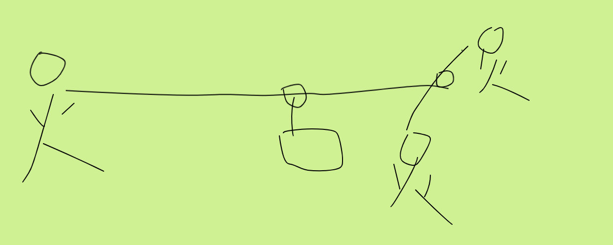

从前有座山，大家都知道这座山上有座庙。

庙里有三个年轻和尚，这三个和尚从不同的地方因为相同的原因，来到了这里。

明释是最早来到这的，他毕业于名校，从小到大都是别人家眼里的好孩子，上进、听话、成绩好。毕业后，他并没有进入他所学的土木行业，而是去做了软件销售。可惜，这个行业没有容下他这个三好学生，白天他在形形色色的人面前强颜欢笑，回到家的时候，把面具取下后，身心俱疲的感觉将他整个身体给包围住。时间久了，他的疲惫焦虑在他身体里慢慢聚集，开始变得惧怕见客户了，甚至有时候一见客户皱眉，他就以为是不是自己哪做错了，于是变得很紧张，浑身紧绷。时间久了，他终于崩溃了，于是来到了这座庙里，开始修行，试图走出焦虑与紧张。

明净和明松是后面来的，他们一个是因为婚姻问题，一个因为写代码思考过度的问题，来到了这里，都试图寻找内心的那份安宁，赶走大脑中的杂念与痛苦。

除了这三个年轻和尚，庙里还有几个老和尚，都已过了花甲之年。他们在几十年前就像这群年轻人一样来到了这里，跟着老和尚一起修行，一转眼的功夫，几十年就过去了，山还是那座山，庙还是那个庙，而他们已经不是当年年轻焦虑的他们了。如今，他们的身躯虽然已经慢慢老去，但是他们早已和自己和解，也和这个世界、宇宙能够和谐安宁地相处了。

这三个年轻和尚刚来的时候，每天的做的事简单又重复，早晨5点起来洗漱好后，便开始出去打水准备一天的用水，只不过为了身体修行，老师傅们给他们了一人两把葫芦瓢，让他们从一里外的地方打两瓢水回来，倒入大水桶中，一直到水桶被装满为止。

刚开始的时候，这三人还觉得打水修行挺新鲜，虽然打回来的水经常洒掉一半，可是为了修行，他们坚持了下来，后来越来越稳，洒的水越来越少，跑去打水的次数也很少。

可是就算这样，他们每人还是得来来回回跑10多次，光打水每天都要花2个多小时，打完水后，他们还要做饭，吃饭，洗碗，这个时候差不多就10点了，于是再打坐2小时，下午继续打坐。

明释是来这最久的，以前他在这一个人挑水回来，一次挑两小桶，跑两次就能倒满大水桶，只需要花费20多分钟，现在要他们三个人花2小时打水，过了这么久他也不明白这算是什么修炼，于是他终于忍不住了，于是叫上明净和明松找到了老师傅讲理。

老师傅正在打坐，听见弟子们叫自己，睁开了眼，缓缓站了起来，说道：“你们终于来了”。明释有些怄气，说：“您也知道我们为什么来找你吧”。老师傅不急不忙的说：“知道”。明松也忍不住好奇说：“那您为什么天天让我们跑那么多趟费那么多时间去打水？这算什么修行呢？”

老师傅说道：“你们现在产生了抗拒心理，说明你们打水的时候思绪已经从打水这个过程脱离开来。接下来我要你们继续打水，但是要感受打水的每个当下的任何感官感受，去吧，半个月后再来找我。”

三个人似懂非懂的离开了，一路上都在琢磨这老师傅说话的含义。

接下来又是简单又重复的日子，但是他们的对打水的排斥渐渐地减少了，他们整个身心已经沉浸在打水的每个过程中，有了以前从未有的体验和感受：他们踏着已被他们踩得坚实的泥土地，一路上的各种花草树木仿佛在打招呼，还散发着不同的气味，让人陶醉，各种鸟声细听仿佛在唠嗑、吵架、唱歌，整体听来又显得热闹的很。打水回来的时候，感受到自己手臂的不同肌肉为了平衡瓢而发力，水瓢里的水自己的控制下小心翼翼的荡漾着。端着瓢时间长了虽然酸痛，但是当观察着这些酸痛的时候，它们却变得不那么难忍受了，仿佛就像自己的影子一样常见。

慢慢地，他们三人已经习惯了这种生活，这就是他们的日常，一点也不特殊，也不累，也不轻松，他们也不做评价，他们所做的，是活在每个当下。


两个月后，老师傅给他们取消了水瓢取水的修炼，因为他们已经懂得沉浸在当下，平时吃饭走路都可以修行了，不需要再来特意修炼了。

于是，明释、明净、明松便三人一起抬着大桶去取水了，以前他们打水要2个多小时，而现在，他们只需要跑一趟，省下2个小时时间，他们就能分配在打坐上面了，他们的修行之路走的更远了。

可是俗话说得好，一个和尚挑水吃，两个和尚抬水吃，三个和尚没水吃，他们三个怎么一次性取水呢？

这难不倒来到山上就已经光头的明松了，明松做程序员的时候经常刷leetcode，这种问题在他面前就是Easy难度，具体怎么做呢？

首先准备两根棍子，两根绳子。将大桶用绳子挂在一根棍子的三分之二处，长的那一端由明释在前面扛着，短的那端末尾用另一根棍子和绳子绑起来，另一根棍子由明净和明松扛着，这样，三个人肩膀上承受的力就都一样啦。就像这样：



老师傅和年轻和尚们都夸明松聪明，明松摸了摸自己的光滑的脑袋，害羞的笑了。


明松通过这段时间打水发现自己以前写的一段代码是可以优化的，本来内心已经变得平静的他突然焦躁不安起来：他给以前公司遗留了垃圾代码。

是什么代码呢？让我们来看看把。

这段代码的逻辑我们就以取水来作为原型好了，为了提升难度，我们规定每个和尚都是自己取水自己用，不能跟别人打的水混在一起了。使用golang伪代码描述：


```go

type user struct {
	name string
	// 几瓢水
	water water
}
// 水的容量，以瓢为单位
type water int

func (u user) fetchWater()(water, error){
	// 花10分钟取一瓢水
	time.Sleep(10 * time.Minute)
	return 1, nil
} 

func main(){
	users := []user{mingshi, mingjing, mingsong}
	for i := 0; i < 12;i++{
		for _, user := range users {
			water， _ := user.fetchWater()
			user.water ++
		}
	}

}


```

从上述逻辑可以看到，每个人取一次水要花费10分钟,并且与三个年轻和尚现实生活中不一样的是，每次只能有一个人出去打水
，三个人同时取12次水，需要花费 12次 * 10分钟 * 3人=  6小时，每人打12瓢水，一共一桶水。

作者使用自己写的库[github.com/EchoUtopia/batch](https://github.com/EchoUtopia/batch),来说明如何三个人打一次就每人打12瓢水，也就是一桶水，只需要花10分钟。这个库原理简单，实现简单，使用也简单，这是这个作者的原则，这一点明松还是很欣赏的。


```go
import github.com/EchoUtopia/batch

type user struct {
	name string
	// 几瓢水
	water int
}


func main (){
	
	var users := []user{mingshi, mingjing, mingsong}

	batchFetchWaterFunc := func(ctx context.Context, keys batch.Keys)(map[string]interface, error){
		// 跑一趟，将所有水打回来。
		time.Sleep(10 * time.Minute)
		result := make(map[string]interface, len(keys))
		for _, key :=range keys {
			result[key.String()] = result[key.String()].(int) + 1
		}
		return result, nil
	}

	bt := batch.NewBatch(context.Background(), batchFetchWaterFunc)
	for i := 0;i<12;i++{
		for _, user := range users {
			bt.Do(batch.StringKey(user.name), func(res interface){
				user.water += res.(int)
				})
		}
	}

	if err := bt.Flush();err != nil {
		panic(err)
	}
}

```
从上面的例子可以看到，batchFetchWaterFunc将水一次性取了回来，这样以前花6个小时的过程现在只需要花10分钟了，明松想下山了，想把他写的遗留代码给优化了。

<p> 
<DIV >
作者： <A href="http://github.com/EchoUtopia">EchoUtopia</A> <BR>
出处： <A href="https://github.com/EchoUtopia/blog/blob/master/monk_fetch_water_in_batch.md">https://github.com/EchoUtopia/blog/blob/master/monk_fetch_water_in_batch.md</A> 
<BR>原创文章，版权声明：自由转载-非商用-非衍生-保持署名
<a href= "http://creativecommons.org/licenses/by-nc-nd/3.0/deed.zh"> Creative Commons BY-NC-ND 3.0 </a>。 
</DIV>
</p>

